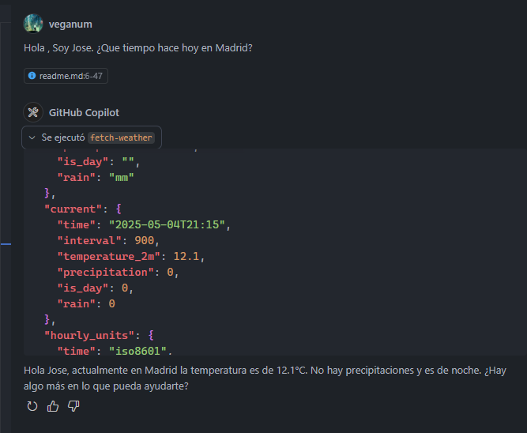
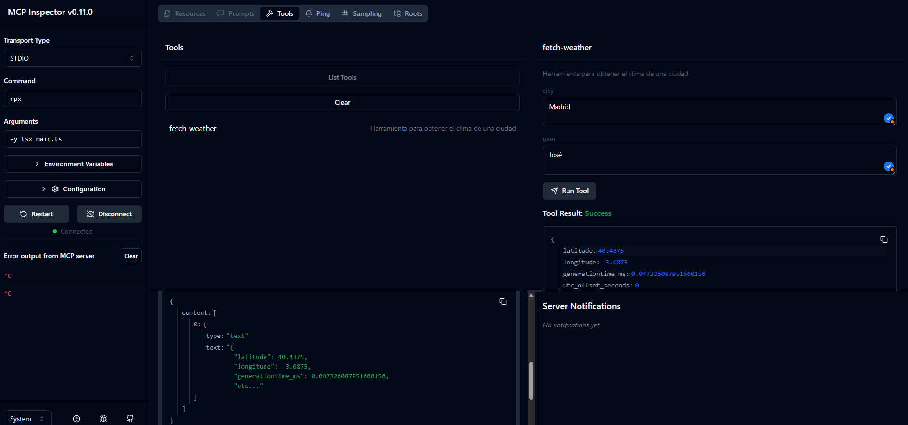

# Proyecto MCP Demo

Este proyecto es una demostración del uso del protocolo MCP (Model Context Protocol) para crear un servidor que interactúa con herramientas definidas por el usuario.

## Descripción

El servidor implementado utiliza el SDK de MCP para manejar la comunicación entre el cliente y el servidor. Además, incluye una herramienta llamada `fetch-weather` que permite obtener información del clima de una ciudad específica. Los datos del clima se obtienen de la API pública de [Open-Meteo](https://open-meteo.com/), utilizando los siguientes recursos:

- [Documentación de Open-Meteo](https://open-meteo.com/en/docs?current=temperature_2m,precipitation,is_day,rain)
- [API de ejemplo](https://api.open-meteo.com/v1/forecast?latitude=52.52&longitude=13.41&hourly=temperature_2m&current=temperature_2m,precipitation,is_day,rain)

## Estructura del Proyecto

- **main.ts**: Archivo principal donde se configura el servidor, las herramientas y el transporte.

## Requisitos

- Node.js
- Paquetes npm:
  - `@modelcontextprotocol/sdk`
  - `zod`

## Uso

1. Instala las dependencias necesarias:

   ```bash
   npm install
   ```

2. Ejecuta el servidor:

   ```bash
   npm run start
   ```

3. Ejecuta el servidor con el inspector:

   ```bash
   npm run start-inpector
   ```

## Herramientas

### fetch-weather

- **Descripción**: Herramienta para obtener el clima de una ciudad.
- **Parámetros**:
  - `city` (string): Nombre de la ciudad.
  - `user` (string, opcional): Nombre del usuario. Por defecto, "Usuario".
- **Fuente de datos**: Los datos se obtienen de la API de Open-Meteo.

## Pruebas

La funcionalidad del servidor puede probarse en las siguientes plataformas:

1. **Claude**: Utiliza Claude para interactuar con el servidor y probar las herramientas.
2. **Visual Studio Code**: Ejecuta el servidor directamente en VS Code y utiliza el inspector para depurar.

3. **Agente MCP**: Conecta un agente MCP para probar las herramientas en un entorno real.


## Mas inspiracion

- [mcp.co](https://open-meteo.com/en/docs?current=temperature_2m,precipitation,is_day,rain)
